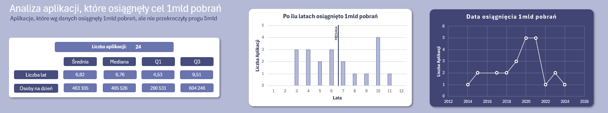

<h1>📊Analiza Najczęściej Pobieranych Aplikacji na Androida</h1>


## 🎯Wstęp

Dashboard przedstawia analizę **najczęściej pobieranych aplikacji na system Android** dostępnych w _Google Play Store_.

Dane pozyskane ze strony _[Kaggle.com](https://www.kaggle.com/)_. Zawierają informacje o: developerach, ogólnej liczbie pobrań, datach publikacji i osiągnięcia wysokich pułapów pobrań, ceny, kategorii, typie i preinstalacji.

#### Plik Dashboard

Plik z dashboardem znajduje się w [Google Play Store Dashboard.xlsx](Google_Play_Store_Dashboard.xlsx).

### Problem analityczny

Celem analizy jest sprawdzenie, jakie aplikacje są **najczęściej pobierane** na świecie, odkrycie wzorców, **dominujących kategorii**, wpływ **wbudowanych aplikacji** na liczbę pobrań. Jakie **firmy** przejęły rynek mobilny postawiony na Androidzie? Ogólny **zysk** z najpopularniejszych aplikacji, które są płatne.

Krótka, osobna analiza aplikacji, które osięgnły liczbę pobrań w przedziale 1mld-5mld.

#### Pytania analityczne:

1. Jakie aplikacje należą do topki?
2. Jakie kategorie są najczęściej pobierane?
3. Developer z największą ilością pobrań i aplikacji?
4. Ile zarobiły płatne aplikacje?
5. Analiza aplikacji z 1mld pobrań.

## ⚙️ Przygotowanie danych

W pierwszej kolejności dane zostały poddane standardowym procedurom ETL. Wykorzystane zostało do tego narzędzie Power Query.


1. Zmiana pierwszego wiersza na nagłówki.
2. Usunięcie duplikatów i pustych wierszy, których nie było w tej bazie danych.
3. Wszystkie dane były odczytane jako tekstowe, więc wykonanie transformacji niektórych kolumn w celu ujednolicenia, głównie kolumny "Price".
4. Zmiana typów danych.
5. Dodano kolumnę, w której zmieniono "Downloands" na typ liczbowy biorąc dolne granice przedziałów
   

6. Brakujące wartości:
   - brak jednej wartości w "Date_reached" oraz czterech w "Date_published" - pozostawiono je,
   - brak jednej wartości w "Pre-installed" dla aplikacji "Google Hangouts", odnaleziono jednak informację, że aplikacja ta niegdyś była domyślnie instalowana na urządzeniach mobilnych, więc uzupełnioną tę informację.

## 🧠 Analiza

### 1️⃣ Jakie aplikacje należą do topki?

Do analizy wybrano kolumny z nazwą, liczbą pobrań i informacją o preinstalacji. Celem było pokazanie 5-ciu topowych aplikacji, jednak ze względu na za mało dokładne dane pokazane zostały wszystkie aplikacje o takiej samej liczbie pobrań.

W celu wyłonienia 5-ciu najczęściej pobieranych aplikacji użyto formuły:

```
=FILTRUJ(STOS.POZ(Dane[App]; Dane[Downloads_Numeric]); Dane[Downloads_Numeric] >= MAX.K(Dane[Downloads_Numeric];5))
```

Dane zawierają kolumnę "Pre-installed", co oznacza że część aplikacji zostało pobranych przez producenta i mogło to znacząco wpłynąć na wyniki.


Formuły kolejno pokazujące 5 najlepszych aplikacji preinstalowanych i nie preinstalowanych:

```
=SORTUJ(FILTRUJ(STOS.POZ(Dane[App]; Dane[Downloads_Numeric]); (LEWY(Dane[Pre_installed];3) = "Yes") * Dane[Downloads_Numeric] >= MAX.K(FILTRUJ(Dane[Downloads_Numeric]; LEWY(Dane[Pre_installed];3) = "Yes"); 5)); 2; -1)
```

```
=SORTUJ(FILTRUJ(STOS.POZ(Dane[App]; Dane[Downloads_Numeric]); (Dane[Pre_installed]= "No") * Dane[Downloads_Numeric] >= MAX.K(FILTRUJ(Dane[Downloads_Numeric]; Dane[Pre_installed] = "No"); 5)); 2; -1)
```

Tabele:


#### Wnioski

Preinstalacja ma decydujący wpływ na popularność i zasięg danej aplikacji. Użytkownicy rzadziej szukają alternatyw dla aplikacji, które otrzymali wraz z zakupem urządzeń mobilnych.

Kolorami zostały porównane powtarzające się wartości, jedynie jedna aplikacja znalazła się w ścisłej czołówce i nie należy do aplikacji preinstalowanych - jest to _WhatsApp Messenger_, co świadczy o niezwykłej popularności tej aplikacji i świadomym wyborze użytkowników.

### 2️⃣ Jakie kategorie są najczęściej pobierane?

Prócz informacji, czy aplikacje zostały preinstalowane, ważna jest także informacja na temat ich kategorii. Preinstalowane aplikacje to w większości wypadków aplikacje potrzebne lub pomagające w codziennym funkcjonowaniu użytkownika.
Ponadto 10% topowych aplikacji to aplikacje nie preinstalowane, więc informacja o najczęstszych kategoriach również jest ważna.


#### Wnioski

Zdecydowanie widać dominację komunikatorów, do których zalicza się m.in. _WhatsApp Messenger_, nie jest to dziwne zważywszy na to, że pierwotnym zastosowaniem smartfonów była komunikacja, ponadto dostęp do ogólnodostępnej sieci komórkowej sprawił, że użytkownicy coraz częściej wybierają darmowe aplikacja niż połączenie telefoniczne czy sms'y.

W ostatnich latach nastąpił gwałtowny wzrost technologii, a urządzenia mobilne stały się już nie tylko komunikatorami, ale także miejscami zapewniającymi rozrywkę, dlatego social media plasują się na drugim miejscu i chociaż wciąż dużo im brakuje do łącznej liczby pobrań komunikatorów, to w nadchodzących latach różnica ta może się zmniejszyć.

### 3️⃣ Developer z największą ilością pobrań i aplikacji?

Przyglądając się danym, można zauważyć, że znaczna większość należy do firmy _Google_. Sumaryczna liczba pobrań dla 5-ciu top developerów wygląda następująco:


Firma _Google_ ma dominującą pozycję na rynku aplikacji mobilnych, o który dba, aby pozostać w ścisłej czołówce. Fakt, że większość aplikacji Google jest preinstalowana, bezpośrednio przekłada się na astronomiczne liczby pobrań, a także na liczbę aplikacji znajdujących się w ścisłej czołówce.


#### Wnioski

_Google_ nie ma realnej konkurencji na rynku aplikacji mobilnych na Androidzie. Firma jest właścicielem większości czołowych aplikacji. _Meta_ można nazwać samodzielnym gigantem, wyróżniającym się spośród reszty developerów (poza Google), warto zauważyć, że jest właścicielem _WhatsApp Messenger_, który nie jest preinstalowany na systemie i stanowi świadomy wybór użytkowników.

W dashboardzie została dodana opcja wybrania developera, a na wykresie pojawią się jego aplikacje i liczba pobrań.


### 4️⃣ Ile zarobiły płatne aplikacje?

Dane poddane analizie zostały podzielone na płatne i darmowe, a płatne na kategorie. Jak można było domniemywać, znaczącą większość stanowią gry.

W danych kategoria "Games" była bardzo rozległa, w końcu same gry mają wiele gatunków, dlatego zastosowano formułę, która ujednoliciła przypisane kategorie:

```
=LET(kategoria; X.WYSZUKAJ(A2;Dane[App]; Dane[Category]); JEŻELI(CZY.LICZBA(SZUKAJ.TEKST("Games"; kategoria)); "Games"; "Inne"))
```


Płatne aplikacje prezentują się następująco:


#### Wnioski

Ceny zakupu nie są duże, ale przy tak wielkiej liczbie pobrań potrafią one wygenerować ogromne zarobki. Mimo to aż 76% aplikacji jest darmowych, a większość płatnych to gry, które mogły być wypromowane przez reklamy, chociaż nie zmienia to faktu, iż żadna gra nie jest preinstalowana, więc wszystkie pobrania są świadomymi działaniami użytkowników.

Pomimo dominującego modelu darmowych aplikacji - a przynajmniej ich podstawowych wersji - płatne aplikacje także potrafią przyciągnąć użytkowników. Drugi wykres kołowy pokazuje także, że użytkownicy o wiele częściej są skłonni wydać pieniądze na rozrywkę, a nie inne aplikacje użytkowe.

### 5️⃣ Analiza aplikacji z 1mld pobrań

Do przeprowadzenia dokładniejszej analizy wybrano te aplikacje, które osiągnęły przedział pobrań 1-5mld - ta grupa okazała się najliczniejsza, licząca aż 24 aplikacje. Przeprowadzono na tej grupie podstawowe obliczenia: średnia, mediana, Q1, Q3 dla liczby dni oraz średniej liczby osób na dzień.



#### Wnioski

Przy sporej popularności aplikacji osiągnięcie pułapu 1mld pobrań zajmuje średnio 6,7 lat. Na rynku można zauważyć kilka aplikacji, które stały się globalnymi fenomenami i osiągnięcie celu zajeło im jedynie 3-4 lata.

Najbardziej sprzyjającym czasem były lata 2019 - 2021, w których nastąpił gwałtowny wzrost pobrań. Może to być bezpośrednio powiązane z pandemią COVID-19 i globalnym lockdownem, który drastycznie zwiększył czas spędzany przed ekranami smartfonów.

## 💡 Konkluzja

Jako przeciętny użytkownik smartfona, który na co dzień używa wiele aplikacji służący komunikacji czy rozrywce, postanowiłam sprawdzić rynek aplikacji mobilnych oraz poddać je analizie, aby odkryć informacje, które na pierwszy rzut oka nie są tak oczywiste, jak mogłoby się wydawać.

Wykorzystując funkcje Excela odkryłam kluczowe informacje, takie jak panujący giganci na rynku, faworyzacja aplikacji firmy Google (o niektórych nawet nie słyszałam, a osiągnęły ponad 10mld pobrań!), które są preinstalowane na niemal wszystkich urządzeniach posiadających Androida, czy ogromna popularność nawet płatnych aplikacji.

Do analizy został stworzony także dashboard, aby zaprezentować najważniejsze trendy i informacje w prostej i przejrzystej formie.
