<h1>📊Analiza Najczęściej Pobieranych Aplikacji na Androida</h1>

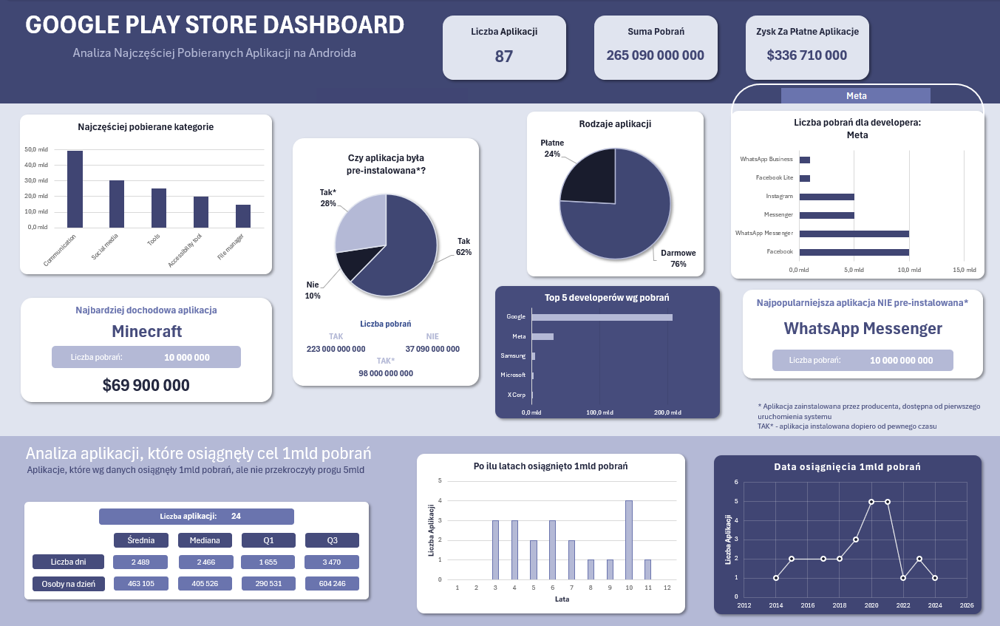

## 🎯Wstęp

Dashboard przedstawia analizę **najczęściej pobieranych aplikacji na system Android** dostępne w sklepie _Google Play Store_.

Dane pozyskane ze strony _[Kaggle.com](https://www.kaggle.com/)_. Zawierają informacje o: developerach, ogólnej liczbie pobrań, datach publikacji i osiągnięcia wysokich pułapów pobrań, ceny, kategorii, typie i pre-instalacji.

#### Plik Dashboard

Plik z dashboardem znajduje się w [Google Play Store Dashboard.xlsx](Google_Play_Store_Dashboard.xlsx).

### Problem analityczny

Celem analizy jest sprawdzenie, jakie aplikacje są **najczęściej pobierane** na świecie, odkrycie wzorców, **dominujących kategorii**, wpływ **wbudowanych aplikacji** na liczbę pobrań. Jakie **firmy** przejęły rynek mobilny postawiony na Androidzie? Ogólny **zysk** z najpopularniejszych aplikacji, które są płatne.

Krótka, osobna analiza aplikacji, które osięgnły liczbę pobrań w przedziale 1mld-5mld.

#### Pytania analityczne:

1. Jakie aplikacje należą do topki?
2. Jakie kategorie są najczęściej pobierane?
3. Developer z największa ilością pobrań i aplikacji?
4. Ile zarobiły płatne aplikacje?

## ⚙️ Przygotowanie danych

W pierwszej kolejności dane zostały poddane standardowym procedurom ETL. Wykorzystane zostało do tego narzędzie Power Query.

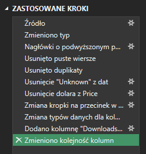

1. Zmiana pierwszego wiersza na nagłówki.
2. Usunięcie dublikatów i pustych wierszy, których nie było w tej bazie danych.
3. Wszystkie dane były odczytane jako tekstowe, więc wykonanie transformacji niektórych kolumn w celu ujednolicenia, głównie kolumny "Price".
4. Zmiana typów danych.
5. Dodano kolumnę, w której zmieniono "Downloands" na typ liczbowy biorąc dolne granice przedziałów
   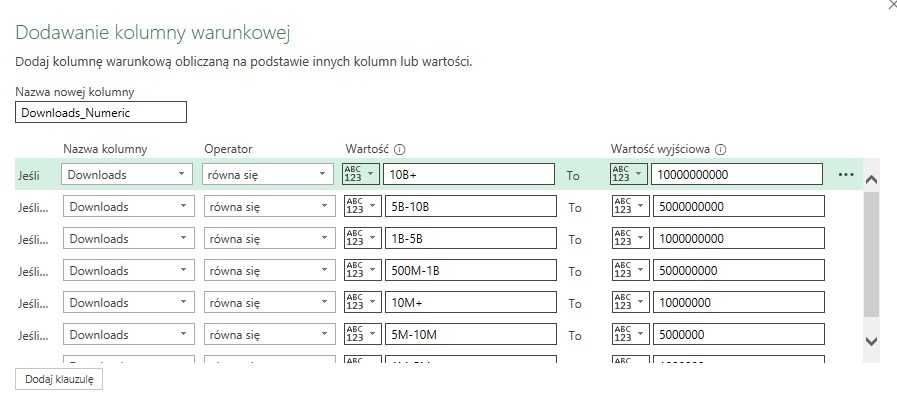

6. Brakujące wartości:
   - brak jednej wartości w "Date_reached" oraz czterech w "Date_published" - pozostawiono je,
   - brak jednej wartości w "Pre-installed" dla aplikacji "Google Hangouts", odnaleziono jednak informację, że apliakcja ta niegdyś była domyślnie instalowana na urządzeniach mobilnych, więc uzupełnioną tę informację.

## 🧠 Analiza

### 1️⃣ Jakie aplikacje należą do topki?

Do analizy wybrano kolumny z nazwą, liczbą pobrań i informacją o pre-instalaji. Celem było pokazanie 5-ciu topowych aplikacji, jednak ze względu na za mało dokładne dane pokazane zostały wszystkie aplikacje o takiej samej liczbie pobrań.

W celu wyłonienia 5-ciu najczęściej pobieranych aplikacji użytko formuły:

`=FILTRUJ(STOS.POZ(Dane[App]; Dane[Downloads_Numeric]); Dane[Downloads_Numeric] >= MAX.K(Dane[Downloads_Numeric];5))`

Dane zawierają kolumnę "Pre-installed", co oznacza że część aplikacji zostało pobranych przez producenta i mogło to znacząco wpłynąć na wyniki.

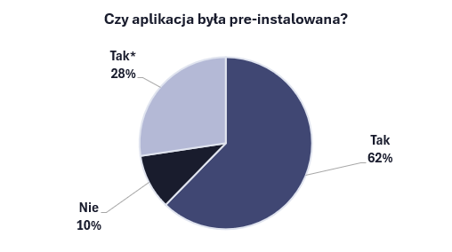

Formuły kolejno pokazujące 5 najlepszych aplikacji pre-instalowanych i nie pre-instalowanych:

`=SORTUJ(FILTRUJ(STOS.POZ(Dane[App]; Dane[Downloads_Numeric]); (LEWY(Dane[Pre_installed];3) = "Yes") * Dane[Downloads_Numeric] >= MAX.K(FILTRUJ(Dane[Downloads_Numeric]; LEWY(Dane[Pre_installed];3) = "Yes"); 5)); 2; -1)`

`=SORTUJ(FILTRUJ(STOS.POZ(Dane[App]; Dane[Downloads_Numeric]); (Dane[Pre_installed]= "No") * Dane[Downloads_Numeric] >= MAX.K(FILTRUJ(Dane[Downloads_Numeric]; Dane[Pre_installed] = "No"); 5)); 2; -1)`

Tabele:

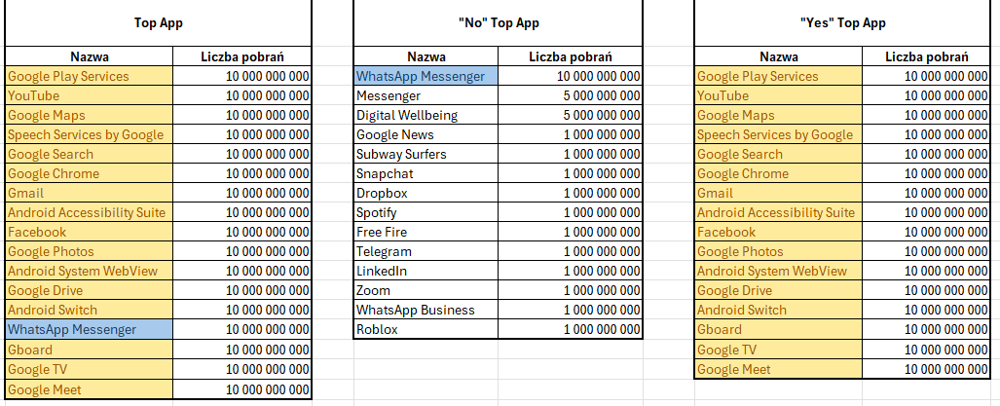

#### Wnioski

Pre-instalacja ma decydujący wpływ na popularność i zasięg danej aplikacji. Użytkownicy rzadziej szukają alternatyw dla aplikacji, które otrzymali wraz z zakupem urządzeń mobilnych.

Kolorami zostały porównanie powtarzające się wartości, jedynie jedna aplikacja znalazła się w ścisłej czołówce i jest to _WhatsApp Messenger_, co świadczy o niezwykłej popualrności tej aplikacji i świadomym wyborze użytkowników.

### 2️⃣ Jakie kategorie są najczęściej pobierane?

Prócz informacji, czy aplikacje zostały preinstalowane, ważna jest także informacja na temat ich kategorii. Preinstalowane aplikacje to w większości wypadków apliakcje potrzebne lub pomagające w codziennym funkcjonowaniu użytkownika.
Ponadto 10% topowych aplikacji to apliakcje nie preinstalowane, więc informacja o najczęstrzych kategoriach również jest ważna.

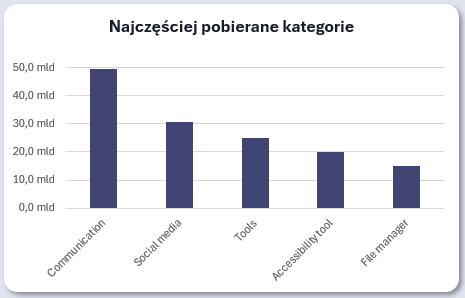

#### Wnioski

Zdecydowanie widać dominację komunikatorów, do których zalicza się m.in. _WhatsApp Messenger_, nie jest to dziwne zważywszy na to, że pierwotnym zastosowaniem smartfonów była komunikacja, ponadto dostęp do ogólnodostępnej sieci komórkowej sprawił, że użytkownicy coraz częściej wybierają darmowe aplikacja niż połączenie telefoniczne czy sms'y.

W ostatnich latach nastąpił gwałtowny wzrost technologii, a urządzenia mobilne stały się już nie tylko komunikatorami, ale także miejscami zapewniającymi rozrywkę, dlatego social media plasują się na drugim miejscu i chociaż wziąć dużo im brakuje do łącznej liczby pobrań komunikatórw, to w nadchodzacych latach różnica ta może się zmniejszyć.

### 3️⃣ Developer z największa ilością pobrań i aplikacji?

Przyglądając się najpopularniejszym aplikacjom, można zauważyć, że znaczna większość należy do firmy _Google_. Sumaryczna liczba pobrań dalego developera wygląda następująco:

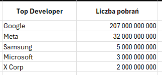
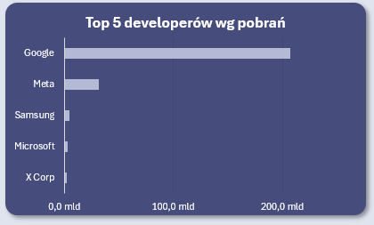

Firma _Google_ ma dominującą pozycję na rynku aplikacji mobilnych, o który dba, aby pozostać w cisłej czołówce. Fakt, że większość aplikacji Google jest preinstalowana, bezpośrednio przekłada się na astronomiczne liczby pobrań, a także na liczbę aplikacji znajdujących się w ścisłej czołówce.

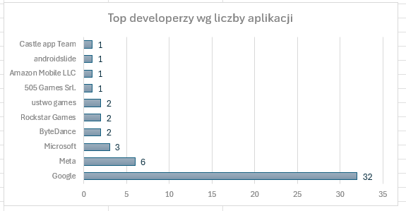

#### Wnioski

_Google_ nie ma realnej konkurencji na rynku aplikacji mobilnych na Androidzie. Firma jest właścicielem większości czołowych aplikacji. _Meta_ można nazwać samodzielnym gigantem, wyróżniającym się spośród reszty developerów (poza Google), warto zauważyć, że jest właścicielem _WhatsApp Messenger_, który nie jest preinstalowany na systemie i stanowi świadomy wybór użytkowników.

W dashboardzie została dodana opcja wybrania developera, a na wykresie pojawią się jego aplikacje i liczba pobrań.

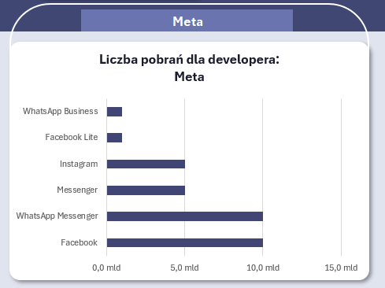
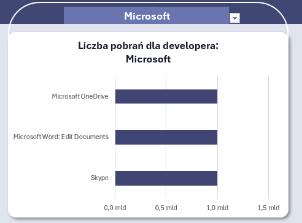

### 4️⃣ Ile zarobiły płatne aplikacje?

Dane poddane analizie zostały podzielone na płatne i darmowe, a płatne na kategorie. Jak można było domniemywać, znaczącą większość stanowią gry.

W danych kategoria "Games" była bardzo rozległa, w końcu same gry mają wiele gatunków, dlatego zastosowno formułę, która ujedoliciła przypisanywane kategorie:

`=LET(kategoria; X.WYSZUKAJ(A2;Dane[App]; Dane[Category]); JEŻELI(CZY.LICZBA(SZUKAJ.TEKST("Games"; kategoria)); "Games"; "Inne"))`

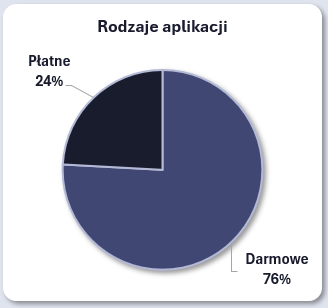
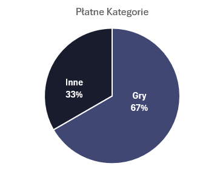

Płatne aplikacje prezentują się następująco:

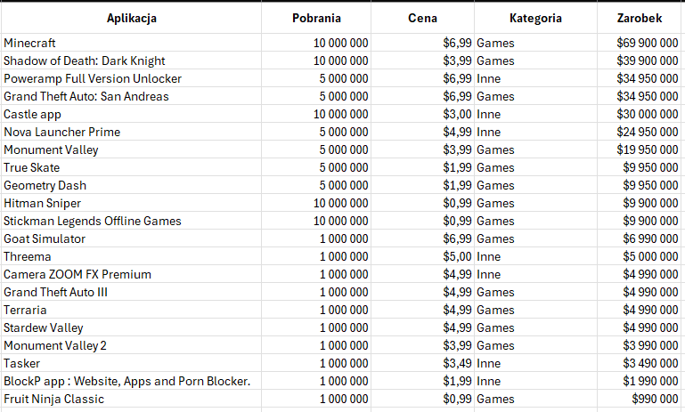

#### Wnioski

Cena zakupu nie jest duża, ale przy tak wielkiej liczbie pobrań potrafią one wygenerować ogromne zarobki. Pokazuje to także, że wiele osób używa smartfonów do rozrywki.
